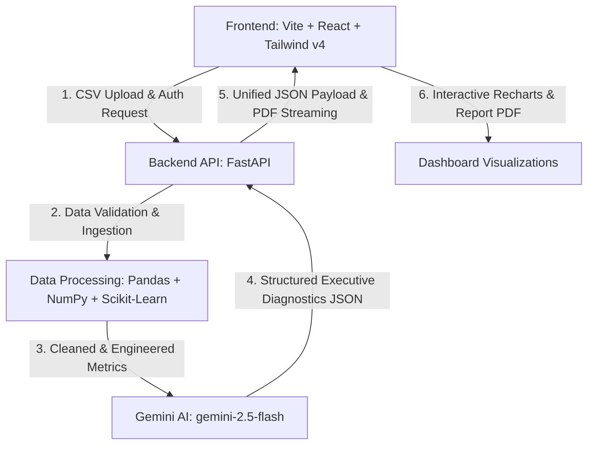

# <p align="center">⚡ Quick Commerce Analyst ⚡</p>

<p align="center">
  <strong>An AI-driven operations diagnostic, cost analytics, and profit margin optimization platform for q-commerce businesses.</strong>
</p>

<p align="center">
  
  
  
  
  
  
  
  
</p>

<p align="center">
  <a href="https://quick-commerce-analyst.vercel.app">
    
  </a>
  <a href="https://github.com/shivanimenaria1-sys/quick-commerce-analyst">
    
  </a>
  <a href="https://quick-commerce-analyst-backend.onrender.com/docs">
    
  </a>
</p>

---

## 📖 Project Overview

### What is Quick Commerce Analyst?
**Quick Commerce Analyst** is a next-generation corporate analytics platform tailored for quick commerce (q-commerce) logistics managers and operations executives. It ingests complex, raw transactional delivery logs, cleanses the data recursively, engineers high-value operational features, and generates interactive business intelligence charts alongside executive diagnostic briefs synthesized by Google Gemini AI.

### The Business Problem It Solves
Quick commerce companies operate on razor-thin margins and demand lightning-fast order-to-delivery loops. Identifying underperforming dark stores, rider utilization issues, low-margin segments, and SLA breach causes from raw database dumps is traditionally slow and manual. This platform bridges that gap by transforming messy tabular logs into actionable executive insights within seconds.

### Why It is Useful
- **Instant Unit Economics**: Computes precise fulfillment costs and flags negative-margin transactions.
- **Automated Data Sanitization**: Resolves duplicate rows, missing entries, and outlier anomalies automatically.
- **Decisions at a Glance**: Blends charts with generative business diagnostics, outlining immediate actions.
- **C-Suite PDF Exports**: Streams professionally formatted PDF reports directly from the pipeline for corporate reviews.

### Target Users
- **Operations Managers** tracking SLA breach percentages and rider shift utilization.
- **Logistics Executives** optimizing regional delivery times and dark store locations.
- **Corporate Financial Analysts** investigating product categories draining unit economics.

### End-to-End Workflow
1. **Authenticate**: Secure Google sign-in.
2. **Ingest & Validate**: Upload transaction CSV logs (verifying all required headers).
3. **Cleanse & Enrich**: Automate outlier, null, and duplicate processing, then run feature engineering (calculating margins, delays, time slots, and rider metrics).
4. **Compile AI Insights**: Send compiled KPIs to Gemini 2.5 Flash to identify strengths, bottlenecks, and recommendations.
5. **Visualize & Export**: Interact with rich SVG charts, inspect the engineered dataset, and download the compiled PDF report.

---

## ✨ Features

- [x] **Google Authentication**: Secure Firebase-backed Google Sign-In wrapper.
- [x] **CSV Upload**: Drag-and-drop file interface powered by `react-dropzone`.
- [x] **CSV Template Download**: Client-side template generator matching required schemas.
- [x] **Dataset Validation**: Real-time validation checks ensuring the presence of all 20 required headers.
- [x] **Data Cleaning**: 
  - Standardizes text fields and casing (Title Case).
  - Handles missing entries with median (numeric) and mode (categorical) values.
  - De-duplicates exact rows and handles invalid date/time inputs.
  - Caps impossible negative figures and executes IQR-based outlier flagging.
- [x] **Feature Engineering**: Derives hour, day of week, weekend flags, time slots, customer order counts, delivery delay minutes, fulfillment costs, profit margins, and rider utilization.
- [x] **Executive Summary**: Core KPI scorecard summarizing total revenue, order count, delivery times, margins, and cancellation rates.
- [x] **Interactive KPI Dashboard**: Recharts-based graphics for detailed analysis.
- [x] **Revenue Analytics**: Visualizes revenue by category and city via dynamic bar charts.
- [x] **Delivery Analytics**: Computes average delivery time and delayed order rates.
- [x] **Customer Analytics**: Line charts illustrating average ratings and month-by-month satisfaction trends.
- [x] **Rider Analytics**: Aggregates rider shift utilization and lists top-performing partners.
- [x] **Hyperlocal Diagnostics**: Maps order density by pincode (horizontal charts) and exposes underserved zones.
- [x] **AI Executive Diagnostics**: Integrates Google Gemini 2.5 Flash to output strengths, risks, opportunities, and recommendations.
- [x] **Engineered Dataset Preview**: Displays the top 10 rows of the newly enriched dataset with derived indicators.
- [x] **PDF Report Download**: Streamable corporate report compiled using WeasyPrint and Jinja2 templates.
- [x] **Responsive UI**: Fully responsive Tailwind CSS layout featuring customized dark and light mode themes.
- [x] **FastAPI Backend**: Uvicorn-hosted async backend with modular routes and Swagger documentation.

---

## 🛠️ Tech Stack

| Component | Technology | Purpose |
| :--- | :--- | :--- |
| **Frontend** | React 19, Vite, Tailwind CSS v4, Lucide Icons | Responsive, high-performance UI dashboard |
| **Backend** | FastAPI, Uvicorn, Jinja2 Templates | Asynchronous, resource-efficient API routing |
| **Authentication** | Firebase SDK (Google Identity Provider) | Client-side authorization and workspace security |
| **AI Platform** | Google Gemini 2.5 Flash (`google-genai` SDK) | AI-powered analytics compilation and decision intelligence |
| **Data Processing** | Pandas, NumPy, Scikit-learn | Tabular data ingestion, cleaning, and mathematical operations |
| **Visualization** | Recharts | Responsive and interactive SVG data charts |
| **PDF Compiler** | WeasyPrint | Compiles HTML templates to PDF documents |
| **Deployment** | Vercel (Frontend), Render (Backend Blueprint) | Auto-deploy pipelines and hosting |
| **Languages** | Python 3.12, JavaScript (ES6+), HTML5, CSS3 | Programming languages |

---

## 📐 Architecture

The platform follows a modular decoupled architecture where data flows sequentially from the user interface down to the processing layer and returns as compiled intelligence:



### Flow Breakdown:
1. **Frontend Request**: The React application sends the user's uploaded CSV log and Google Firebase credentials to the API.
2. **Backend API Route**: FastAPI validates the incoming session request and routes the payload to the ingestion engine.
3. **Data Processing Pipeline**: Pandas and NumPy standardise column headers, impute null entries, remove duplicates, cap negative anomalies, and engineer derived dimensions (margins, time slots, delays).
4. **Gemini AI Diagnostics**: The aggregated metrics are summarized in a prompt and queried against `gemini-2.5-flash` using structured JSON schemas to capture opportunities and recommendations.
5. **Dashboard Visualizations**: The final structured payload returns to the frontend, updating the interactive Recharts widgets and populating the engineered preview tables.

---

## 🔗 Live Demo

- **Production Interface (Frontend)**: [https://quick-commerce-analyst.vercel.app](https://quick-commerce-analyst.vercel.app)
- **FastAPI Core Endpoint (Backend)**: [https://quick-commerce-analyst-backend.onrender.com/health](https://quick-commerce-analyst-backend.onrender.com/health)
- **Interactive Swagger Documentation**: [https://quick-commerce-analyst-backend.onrender.com/docs](https://quick-commerce-analyst-backend.onrender.com/docs)

---

## 📸 Screenshots

### 1️⃣ Login Page


Secure entry gate integrating Google Auth sign-in credentials managed under Firebase SDK.

---

### 2️⃣ Upload Dataset


Interactive drag-and-drop CSV upload widget showing real-time column checks and standard template files.

---

### 3️⃣ AI Processing Pipeline


Live execution interface displaying processing stages (cleaning, engineering, KPI compiling, AI query) in real-time.

---

### 4️⃣ Executive Summary


Platform dashboard header displaying computed operations health scores, core KPIs, and ingestion statistics.

---

### 5️⃣ Analytics Dashboard


Visual data panel showing Recharts categories, location revenues, and rating trends over time.

---

### 6️⃣ Engineered Dataset Preview


Dynamic table presenting first-row items of the cleaned and enriched dataset.

---

### 7️⃣ AI Diagnostics


Operational strengths and bottleneck lists generated using Gemini model reasoning.

---

### 8️⃣ Opportunities & Recommendations


Actionable opportunities and numbered recommendations designed to optimize dispatch times and margins.

---

### 9️⃣ PDF Report


Downloadable, print-ready corporate analytical PDF generated using WeasyPrint styles.

---

## ⚙️ Installation

### Prerequisites
- Python 3.12+ installed
- Node.js 18+ installed
- Docker (optional, for containerization)
- GTK+ Library (Required for WeasyPrint PDF compiler on Windows/macOS. See [WeasyPrint docs](https://doc.courtbouillon.org/weasyprint/stable/first_steps.html#installation))

### Setup Backend:
1. Navigate to the backend directory:
   ```bash
   cd backend
   ```
2. Create and activate a python virtual environment:
   ```bash
   python -m venv venv
   # On Windows:
   .\venv\Scripts\activate
   # On macOS/Linux:
   source venv/bin/activate
   ```
3. Install required libraries:
   ```bash
   pip install -r requirements.txt
   ```
4. Copy the environment template and insert your API credentials:
   ```bash
   cp .env.example .env
   ```
5. Spin up the FastAPI server:
   ```bash
   uvicorn app.main:app --reload
   ```

### Setup Frontend:
1. Navigate to the frontend directory:
   ```bash
   cd frontend
   ```
2. Install npm packages:
   ```bash
   npm install
   ```
3. Run the development server:
   ```bash
   npm run dev
   ```

---

## 🔒 Environment Variables

### Backend Configuration (`backend/.env`)
Create a `.env` file in the `backend/` directory:
```env
# API Server Configuration
PORT=8000
HOST=127.0.0.1

# Google Gemini API Access Credentials
GEMINI_API_KEY=your_gemini_api_key_here

# Allowed CORS Origins (comma-separated list)
CORS_ORIGINS=https://quick-commerce-analyst.vercel.app,http://localhost:5173
```

### Frontend Configuration (`frontend/.env`)
Create a `.env` file in the `frontend/` directory:
```env
# Backend API Base Endpoint
VITE_API_BASE_URL=http://127.0.0.1:8000

# Firebase SDK Auth Configuration
VITE_FIREBASE_API_KEY=your_firebase_api_key
VITE_FIREBASE_AUTH_DOMAIN=your-firebase-project.firebaseapp.com
VITE_FIREBASE_PROJECT_ID=your-firebase-project
VITE_FIREBASE_STORAGE_BUCKET=your-firebase-project.firebasestorage.app
VITE_FIREBASE_MESSAGING_SENDER_ID=your_messaging_sender_id
VITE_FIREBASE_APP_ID=your_firebase_app_id
VITE_FIREBASE_MEASUREMENT_ID=your_measurement_id
```

---

## 📂 Folder Structure

```text
quick-commerce-analyst/
├── backend/
│   ├── app/
│   │   ├── models/
│   │   │   └── __init__.py
│   │   ├── routes/
│   │   │   ├── __init__.py
│   │   │   ├── analysis.py
│   │   │   ├── cleaning.py
│   │   │   ├── engineering.py
│   │   │   ├── insights.py
│   │   │   ├── kpis.py
│   │   │   ├── report.py
│   │   │   └── upload.py
│   │   ├── services/
│   │   │   ├── __init__.py
│   │   │   ├── data_cleaning.py
│   │   │   ├── data_ingestion.py
│   │   │   ├── feature_engineering.py
│   │   │   ├── insight_generator.py
│   │   │   ├── kpi_engine.py
│   │   │   └── report_generator.py
│   │   ├── templates/
│   │   │   └── report_template.html
│   │   ├── utils/
│   │   │   ├── __init__.py
│   │   │   └── serialization.py
│   │   └── main.py
│   ├── data/
│   │   └── .gitkeep
│   ├── .env
│   ├── .env.example
│   ├── Dockerfile
│   └── requirements.txt
├── frontend/
│   ├── public/
│   │   ├── favicon.svg
│   │   └── icons.svg
│   ├── src/
│   │   ├── assets/
│   │   │   ├── hero.png
│   │   │   ├── react.svg
│   │   │   └── vite.svg
│   │   ├── components/
│   │   │   └── ProtectedRoute.jsx
│   │   ├── context/
│   │   │   ├── AnalysisContext.jsx
│   │   │   └── ThemeContext.jsx
│   │   ├── pages/
│   │   │   ├── Dashboard.jsx
│   │   │   ├── Login.jsx
│   │   │   └── Upload.jsx
│   │   ├── services/
│   │   │   └── api.js
│   │   ├── App.css
│   │   ├── App.jsx
│   │   ├── constants.js
│   │   ├── index.css
│   │   └── main.jsx
│   ├── .env
│   ├── .gitignore
│   ├── .oxlintrc.json
│   ├── package.json
│   ├── package-lock.json
│   ├── vercel.json
│   └── vite.config.js
├── README.md
├── render.yaml
└── .gitignore
```

---

## 🔌 API Endpoints

### Health Check
- **`GET /health`**
  - Monitor core service health status. Returns `{"status": "ok"}`.

### Ingestion & Pre-processing
- **`POST /api/upload`**
  - Upload raw transactional logs. Parses columns, validates against requirements, and returns a unique `session_id`.
- **`POST /api/clean/{session_id}`**
  - Impute nulls, drop duplicates, cap outliers, and format dates in the session store.
- **`POST /api/engineer/{session_id}`**
  - Calculate fulfillment margins, rider active metrics, time slots, and return previews.

### Diagnostic Pipelines
- **`GET /api/kpis/{session_id}`**
  - Compute operational KPI groups (satisfaction, financial, delivery, hyperlocal, riders).
- **`GET /api/insights/{session_id}`**
  - Query Gemini 2.5 Flash for operational strengths, bottlenecks, and recommendations.
- **`POST /api/analyze/{session_id}`**
  - Executes cleaning, engineering, KPI compilation, and AI diagnostics in a single call.
- **`GET /api/report/{session_id}`**
  - Compiles KPIs and AI critiques into a print-ready corporate analytical PDF.

---

## 🚀 Deployment

### Backend Deployment (Render Web Service)
This application includes a standard `render.yaml` template configured for Blueprint deployment.
1. Connect your Github repository to [Render](https://render.com).
2. Choose **New** -> **Blueprint**.
3. Select this repository and click **Deploy**.
4. Set required variables in the Render dashboard:
   - `GEMINI_API_KEY`: Your Gemini API access credentials.
   - `CORS_ORIGINS`: Your Vercel frontend URL.

### Frontend Deployment (Vercel)
Deploy React 19 builds directly:
1. Connect your repo in Vercel.
2. Select `frontend` as the **Root Directory**.
3. Use Build Command: `npm run build` and Output Directory: `dist`.
4. Configure all environment variables (starting with `VITE_`).

---

## 🔮 Future Improvements

- [ ] **Historical Analytics**: Compare reports side-by-side to track performance changes across multiple months.
- [ ] **Multiple AI Models**: Allow users to toggle between Google Gemini, Claude, and GPT models.
- [ ] **User Workspaces**: Save historical CSV datasets in dedicated personal user profiles.
- [ ] **Cloud Storage integration**: Save PDF report templates directly to AWS S3 or Google Cloud Storage buckets.
- [ ] **Scheduled reports**: Set automated triggers to email operational dashboards directly to stakeholders.
- [ ] **Team collaboration**: Shared multi-user dashboard workspace hubs.
- [ ] **Role-based Authentication**: Granular access control for riders, dark store managers, and executives.
- [ ] **More Visualizations**: Additional maps, charts, and diagrams representing rider traffic routes.
- [ ] **Third-party API Integrations**: Directly fetch transaction feeds from Shopify, Salesforce, or local ERP backends.

---

## 🤝 Contributing

Contributions are welcome! Please follow these guidelines:

1. **Fork** the repository and create your feature branch:
   ```bash
   git checkout -b feature/AmazingFeature
   ```
2. **Commit** your changes following conventional standards:
   ```bash
   git commit -m "feat: add user workspace templates"
   ```
3. **Push** your branch:
   ```bash
   git push origin feature/AmazingFeature
   ```
4. Open a **Pull Request** detailing changes, benchmarks, and screenshot proofs.

---

## 📄 License

Distributed under the MIT License. See `LICENSE` for more information.

---

## 📬 Contact

- **GitHub**: [https://github.com/shivanimenaria1-sys](https://https://github.com/shivanimenaria1-sys)
- **LinkedIn**: [Shivani Menaria](https://www.linkedin.com/in/shivani-menaria-681a13346)
- **Email**: [shivanimenaria1@gmail.com](mailto:shivanimenaria1@gmail.com)

<p align="center">
  Made with ⚡ by <a href="https://github.com/shivanimenaria1-sys">Shivani Menaria</a>
</p>
